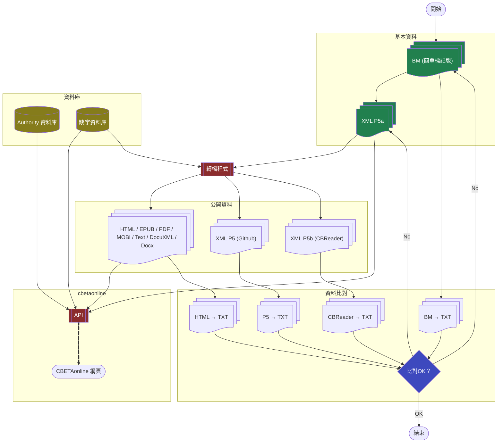

# CBETA Documentation

這是一份供資訊技術人員使用的 CBETA 技術說明文件。

## What is CBETA

請參考 [CBETA 官網](http://www.cbeta.org/)

## CBETA 數位檔案 Big Picture

## XML

CBETA 文本採用的主要格式，說明詳見 [xml](xml) 資料夾。

## BM

CBETA Basic Markup 又稱「簡單標記版」，一冊一檔，純文字加上行首資訊、簡單標記。

[CBETA BM on Github](https://github.com/mahawu/BM_u8)

## 藏經代碼

CBETA 佛典集成收錄多套藏經，每套藏經給予一個唯一的 ID，列表請看 [這裡](http://www.cbeta.org/format/id.php)。

### 藏經排序

目錄排序（以下為各個藏經代碼）:  
T X A K S F C U P J L G M D N ZS I ZW B GA GB

全文檢索結果依據資料的參考價值按以下藏經代碼排序:  
T X A K S F C D U P J L G M N ZS I ZW B GA GB

上面兩種排序主要差別在 D 《國家圖書館善本佛典》。

## 卍續藏 三種版本

CBETA 網站對於 [卍續藏三種版本及其對照說明](http://www.cbeta.org/data-format/zrx.htm#zrx)

CBETA 在 Github 上的 [卍續藏X2R行號對照表](https://github.com/cbeta-git/cbwork-common-X2R)

## 典籍編號

請看 [work-id](work-id.md)

## 插圖

<https://github.com/cbeta-git/CBR2X-figures>

## 缺字圖檔

* 漢字 <https://github.com/cbeta-org/gaiji-CB>
* 悉曇字 <https://github.com/cbeta-org/sd-gif>
* 蘭札體 <https://github.com/cbeta-org/rj-gif>

## 電子書封面

<https://github.com/cbeta-org/ebook-covers>
