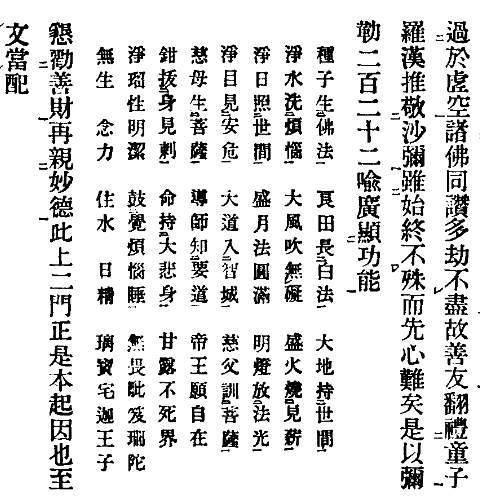
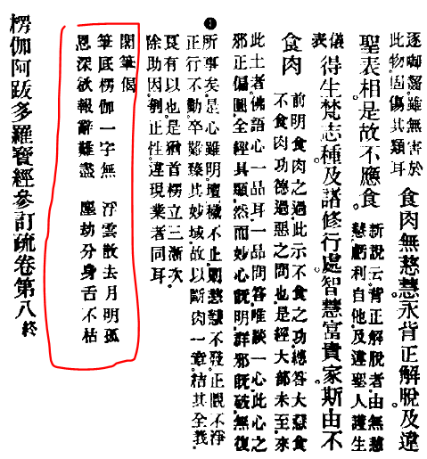

# lg

偈頌

參考：[TEI lg 元素](http://www.tei-c.org/release/doc/tei-p5-doc/zh-TW/html/ref-lg.html)

例如 T02n0125.xml 《增壹阿含經》

```xml
<lg>
  <l>「諸惡莫作，</l><l>諸善奉行，</l>
  <l>自淨其意，</l><l>是諸佛教。</l>
</lg>
```

## @place

### inline

偈頌不是從行首開始，例 T53n2121.xml

```xml
<lb n="0125c04" ed="T"/><p>夫言。</p><lg cb:place="inline"><l>是法未曾聞</l><l>而今聞汝說</l>
<lb n="0125c05" ed="T"/><l>何處聞正法</l><l>而不憂念子</l></lg>
```
## @rend

### bold

ex: Y07n0007.xml, p. 23a09

```xml
<lg type="abnormal" rend="bold">
  <l>
    歸命盡十方：最勝業遍知，色無礙自在，救世大悲者；
    及彼身體相，法性真如海，無量功德藏；如實修行等。
  </l>
</lg>
```

### kaiti 楷體

ex: Y25n0025.xml, p. 478a11

```xml
<lg style="margin-left:3em" type="abnormal" rend="kaiti">
  <l>吾來大唐國，　傳教救迷情，　一花開五葉，　結菓自然成。</l>
</lg>
```

### mingti 明體

ex: Y25n0025.xml, p. 417a06

```xml
<lg rend="mingti" style="margin-left:3em">
  <l>身是菩提樹，　心如明鏡臺，　時時勤拂拭，　莫使有塵埃！</l>
</lg>
```

## @style

ex: GA045n0049.xml, p. 236a10

```xml
<lg type="abnormal" cb:place="inline" style="text-indent:2em">
  <l>一聲吼破太虛空　爍爍禪光橫大有</l>
</lg>
```

## @type

### type="regular" 規則偈頌

```xml
<lg type="regular" style="margin-left:1em;text-indent:-1em">
  <l>「比丘集法堂，<caesura/>講說賢聖論；</l>
  <l>如來處靜室，<caesura/>天耳盡聞知。</l>
  ⋯⋯中略⋯⋯
  <l>無上天人尊，<caesura/>記於過去佛。」</l>
</lg>
```

## @subtype

### subtype="note1" 夾註偈頌

例 X09n0243_p0343b16



```xml
<lg subtype="note1">
  <l>種子生佛法</l><l>良田長白法</l><l>大地持世間</l>
  ...
</lg>
```

### subtype="v5"

例 T07n0220_p0957a11

```xml
<lg type="regular" subtype="v5" style="margin-left:1em;text-indent:-1em">
  <l>「總持猶妙藥，<caesura/>能療眾惑病，</l>
  <l>亦如天甘露，<caesura/>服者常安樂。」</l>
</lg>
```

### subtype="v7"

例 T07n0220_p0957b06

```xml
<lg type="regular" xml:id="lgT07p0957b0601" subtype="v7" style="margin-left:2em;text-indent:-2em">
  <l>「『二人遠離王賊等，<caesura/>所不能侵大寶藏，</l>
  <l>百千萬劫法難聞，<caesura/>得聞不持不施等。</l>
  <l>大菩提心護正法，<caesura/>如教修行心寂靜，</l>
  <l>自利利他心平等，<caesura/>是則名真供養佛。』</l>
</lg>
```

### subtype="note2"

雙行小字偈頌，例 X18n0332



```xml
<lg type="regular" subtype="note2">
  <l>筆底楞伽一字無<caesura/>浮雲散去月明孤</l>
  <l>恩深欲報辭難盡<caesura/>塵劫分身舌不枯</l>
</lg>
```

## l 的 parent 不是 lg

l 可能不是直接被包在 lg 裡，而是在 lem 裡面，計算第幾個 l 的時候要注意，例如 T18n0908.xml:

```xml
<lg>
	...
	<app n="0917005">
		<lem wit="【大】"><l>繒繫亦如上</l><l>舍那半三股</l><l>蓮座火焰光</l></lem>
		<rdg resp="Taisho" wit="【明】">智者應善知審諦無錯謬</rdg>
	</app>
	<app n="0917006">
		<lem wit="【大】"><l>智者應善知</l><l>審諦無錯謬</l></lem>
		<rdg resp="Taisho" wit="【明】">繒繫亦如上舍那半三股蓮座火焰光</rdg>
	</app>
</lg>
```

